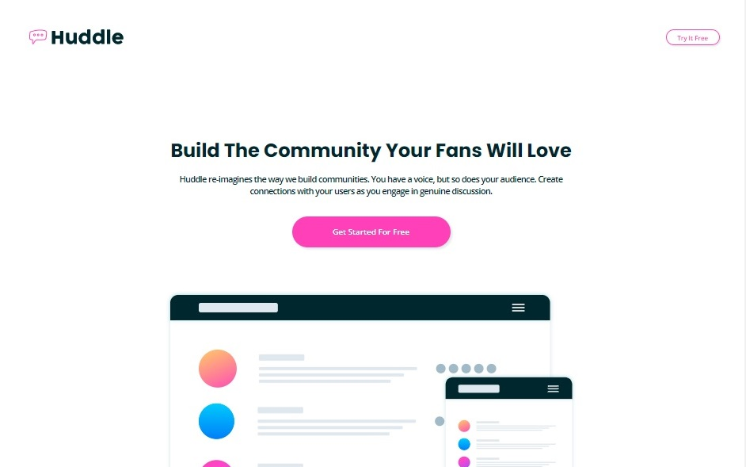
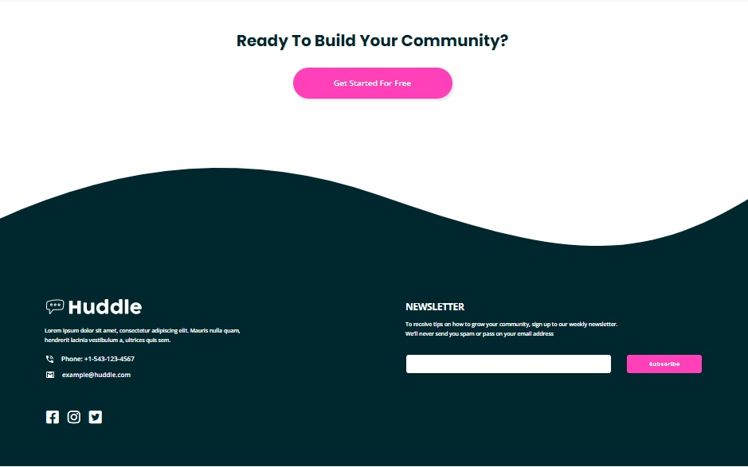
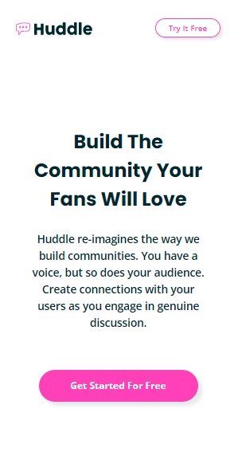
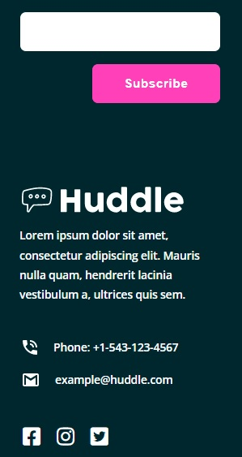

# Frontend Mentor - Huddle landing page with curved sections solution

This is a solution to the [Huddle landing page with curved sections challenge on Frontend Mentor](https://www.frontendmentor.io/challenges/huddle-landing-page-with-curved-sections-5ca5ecd01e82137ec91a50f2). Frontend Mentor challenges help you improve your coding skills by building realistic projects. 

## Table of contents

- [Overview](#overview)
  - [The challenge](#the-challenge)
  - [Screenshot](#screenshot)
  - [Links](#links)
- [My process](#my-process)
  - [Built with](#built-with)
  - [What I learned](#what-i-learned)
  - [Continued development](#continued-development)
  - [Useful resources](#useful-resources)
- [Author](#author)
- [Acknowledgments](#acknowledgments)

## Overview

### The challenge

Users should be able to:

- View the optimal layout for the site depending on their device's screen size
- See hover states for all interactive elements on the page

### Screenshot

| Desktop layout |
|:--:|
 

| Mobile layout |
|:--:|
 

### Links

- Solution URL: https://github.com/PavlinaPs/huddle-landing-page-with-curved-sections
- Live Site URL: https://pavlinaps.github.io/huddle-landing-page-with-curved-sections/

## My process

### Built with

- Semantic HTML5 markup
- Custom variables
- Flexbox
- CSS Grid areas
- Sass partials

### What I learned

This is my first junior challenge. I loved it. I realized again how important it is to plan ahead and before the first line of code. I had planned the flexboxes and grids before I started, but didn't plan enough for spilling backgrounds margins and paddings.

I decided to have the curves as and \ element, so it always stacks on top/under sections with the same background color. First tried it with pseudo-elements on sections but I couldn't guarantee the position when responsive. Or I don't know how to yet.

I am getting more familiar with Sass, I love partials, used nesting. Finally figured out @use and @forward since @import is deprecated.

I think I can handle simple e-mail validation quite well now.

### Continued development

I would like to explore and use more Sass features like mixins in the next challenges. I recently discovered the 7-1 Pattern, a way how to organize partials.

I also have some issues with organizing font sizes and media queries in Sass, I need to do some research on that.

I also saw two videos on form validation css and js, I am going to watch them again and code along to explore more possibilities when validating.

### Useful resources

- [The 7-1 Pattern](https://sass-guidelin.es/#the-7-1-pattern)
- [Get your stylesheets more organized with Sass partials](https://youtu.be/9Ld-aOKsEDk) - Kevin Powell's tutorial

- [JavaScript Client-side Form Validation](https://youtu.be/rsd4FNGTRBw) - tutorial by Florin Pop
- [Styling Form Validation Errors - HTML & CSS Web Design Tutorial](https://youtu.be/6NdWrZ77YO4) - tutorial by dcode

## Author

- GitHub - [PavlinaPs](https://github.com/PavlinaPs)
- Frontend Mentor - [@PavlinaPs](https://www.frontendmentor.io/profile/PavlinaPs)

## Acknowledgments

It is great that I can solve Frontend Mentor's challenges. They are all very useful for me. Thank you!
